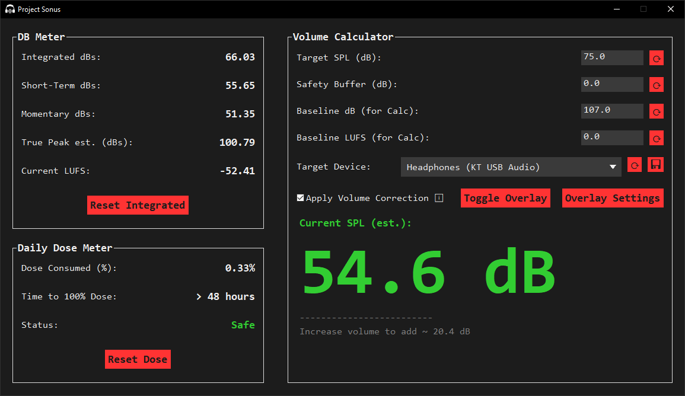

# Project Sonus

**Measures audio levels to provide real-time feedback for safe listening.**

Project Sonus is a windows application designed for users who want to monitor and manage their audio listening levels in real-time. It provides accurate, professional-grade loudness metrics (LUFS) and sound pressure level (SPL) estimates to help prevent hearing damage and manage daily sound exposure.

Whether you're a music producer, a gamer, or just someone who listens to audio for long periods, Project Sonus gives you the tools to understand and control your listening environment.

---

## Table of Contents

- [Features](#features)
- [Screenshot](#screenshot)
- [System Requirements](#system-requirements)
- [Getting Started](#getting-started)
  - [Installation](#installation)
  - [Running the Application](#running-the-application)
- [How To Calibrate](#how-to-calibrate)
- [How It Works](#how-it-works)
  - [The Meters](#the-meters)
  - [The Volume Calculator](#the-volume-calculator)
  - [The Daily Exposure Budget](#the-daily-exposure-budget)
- [Configuration](#configuration)
- [For Developers](#for-developers)
  - [Project Structure](#project-structure)
  - [Technology Stack](#technology-stack)
  - [Development & Build](#development--build)
- [License](#license)

## Features

- **Professional Loudness Metering:** Implements the ITU-R BS.1770 standard to provide accurate LUFS (Loudness Units Full Scale) measurements.
- **Real-Time SPL Estimation:** Calibrate the application to your audio device to get a real-time estimate of the Sound Pressure Level (dB SPL) you are being exposed to.
- **Live Audio Monitoring:** Captures system audio to measure any sound playing on your computer.
- **Key Metrics (Configurable):**
  - **Integrated LUFS/dBs:** Loudness averaged over a long period.
  - **Short-Term LUFS/dBs:** Loudness over the last 3 seconds.
  - **Momentary LUFS/dBs:** Loudness over the last 400ms.
  - **True Peak Estimation:** Measures the highest peak level of the audio signal.
- **Daily Dose Meter:** Tracks your daily sound exposure based on NIOSH standards, helping you stay within safe listening limits.
- **Real-Time Volume Guidance:** Tells you precisely how to adjust your system volume to hit a target listening level.
- **Device Profiles:** Save and load different calibration profiles for each of your audio devices (headphones, speakers, etc.).
- **Highly Efficient:** Utilizes multiple optimization strategies to minimize resource usage. You can play games while protecting your ears, without worrying about losing any frames.
- **Highly Configurable:** Offers a variety of settings that let you tweak performance or customize the app with custom fonts and colors.

## Screenshot



## System Requirements

**Operating System:**

- Windows 10 or later (64-bit)

**Hardware:**

- **CPU:** Any x64 processor
- **Memory:** 1 GB RAM
- **Disk Space:** 250 MB of free disk space

**Additional Notes:**

- Runs as a standalone executable — no installation needed
- Works without administrator privileges
- Internet connection not required

## Getting Started

### Installation

The easiest way to use Project Sonus is to download the latest release.

1. Go to the [**Releases Page**](https://github.com/basimali-ai/Project-Sonus/releases).
2. Download the `Project-Sonus-X.X.X.zip` file from the latest release.
3. Extract the contents of the ZIP file to a folder on your computer.

### Running the Application

Inside the extracted folder, you will find `Project Sonus.exe`:

- Double-click this file to launch the application.
- If opened from a terminal, you’ll see detailed logs and live feedback.

> **Note:** Notifications may appear under the default console name (e.g. 'Command Prompt').
> This is expected behavior and ensures compatibility between console and GUI-only modes.
> Additionally, the application automatically restarts every 12 hours (configurable) to prevent memory buildup over long runtimes.

## How To Calibrate

1. Download **Decibel X** on your phone from **Google Play Store** or **App Store**.

2. Play pink noise from Youtube or any other platform.

3. In the left pane of Project Sonus, you will see a **'Current LUFS:'** value. Type that value in the **'Baseline LUFS'** entry field on the right pane.

4. Now open **Decibel X** on your phone, and put your phone at your typical listening position. For headphones, put your phone mic inside the ear cups and press gently for artificial sealing if necessary.

5. Touch the play icon on the **Decibel X** app, then type the value being shown in **'Baseline dB'** entry field on the right pane of the Project Sonus window.

6. Press the **Save** button on the right pane of Project Sonus (it's right next to the **'Target Device'** dropdown).

7. **And you're all set!**

## How It Works

### The Meters

The main meters on the left provide a live view of your system's audio levels, converted into dBs based on your calibration settings as well as a current LUFS value to calibrate your equipment.

- **Integrated dBs:** The long-term average loudness. Press **Reset Integrated** to restart this measurement.
- **Short-Term & Momentary dBs:** Faster-reacting meters that show recent loudness.
- **True Peak est. (dBs):** The highest sample peak. This will turn yellow if your audio is at the risk of clipping or red if it gets dangerously high.
- **Current LUFS:** Represents a value between Short-Term and Momentary dBs in terms of reactivity. It is designed to help you calibrate the app.

### The Volume Calculator

This is the core of the application.

1. **Calibrate:**
   - **Baseline dB & LUFS:** These values are unique to your audio device (headphones/speakers) at a specific volume level. You need to calibrate these once per device for accurate SPL estimates.
   - **Target Device:** Select the audio device you are listening on. The application will monitor this device's output.
2. **Set Your Goal:**
   - **Target SPL (dB):** Enter the desired listening level you want to achieve (e.g., 75 dB for safe, long-term listening).
3. **Get Guidance:** The application will provide real-time feedback, telling you to increase or decrease your volume to match your target.

### The Daily Exposure Budget

Based on NIOSH standards, this meter tracks your accumulated sound "dose" throughout the day. Listening at higher volumes uses up your budget faster. The goal is to stay under 100% for the day to minimize the risk of hearing damage.

- **Reset Dose:** The dose is automatically reset every 24 hours, but you can reset the daily dose at any time. The dose is saved automatically when you close the application or Save device profile.

## Configuration

On the first launch, Project Sonus will create configuration and data files in your user directory. You can edit these files for advanced configuration.

- **Location:**
  - **Settings (`config.yaml`):** `%LOCALAPPDATA%\ProjectSonus\ProjectSonus\`
  - **User Data (`dose_data.json`):** `%LOCALAPPDATA%\ProjectSonus\ProjectSonus\`

You can open these paths by pasting them into your Windows File Explorer address bar.

## For Developers

### Project Structure

- `src/`: Contains all application source code
  - `src/project_sonus/`: Core application
  - `src/project_sonus_utils/`: Utilities (logging, splash screen)
  - `src/main.py`: Main entry point
  - `src/restarter.py`: Auto Restarter
- `scripts/`: Development tools, including dependency installer and build script

### Technology Stack

- **Language:** `Python ≥3.12.10, <3.13`
- **GUI:** `wxPython`
- **Audio Capture:** `SoundCard`
- **Audio Processing:** `numpy`, `scipy`, `NumCircBuf`
- **Windows Integration:** `pycaw`, `comtypes`, `pywin32`
- **Configuration:** `ruamel.yaml`, `appdirs`
- **Image Display:** `pillow`
- **Notifications:** `Windows-Toasts`
- **Dependency Management:** `setuptools`

### Development & Build

These steps are **required** if you want to modify or build the project from source.

1. **Clone the repository**

   ```bash
   git clone https://github.com/basimali-ai/Project-Sonus.git
   cd Project-Sonus
   ```

2. **Install dependencies**

   ```bash
   .\scripts\install_dependencies.bat
   ```

3. **Run the project in development mode**

   ```bash
   sonus
   ```

   > Running the project ensures all dependencies and configurations are correctly set. This is required before building the executable.

4. **Build the executable**

   ```batch
   .\scripts\build.bat
   ```

   > The resulting `.exe` will be in the `dist/` folder and is standalone (no Python or dependencies required to run).

### Notes

- All scripts **first verify your Python version** before attempting any installation or build.
- `build.bat` ensures `Nuitka` is present before building.
- Scripts are Windows-only and designed for `Python ≥3.12.10, <3.13`.
- Dependencies are currently pinned to specific versions until wider compatibility is verified.

## License

This project is licensed under the Apache License 2.0. See the [LICENSE](LICENSE) and [NOTICE](NOTICE) files for details.
